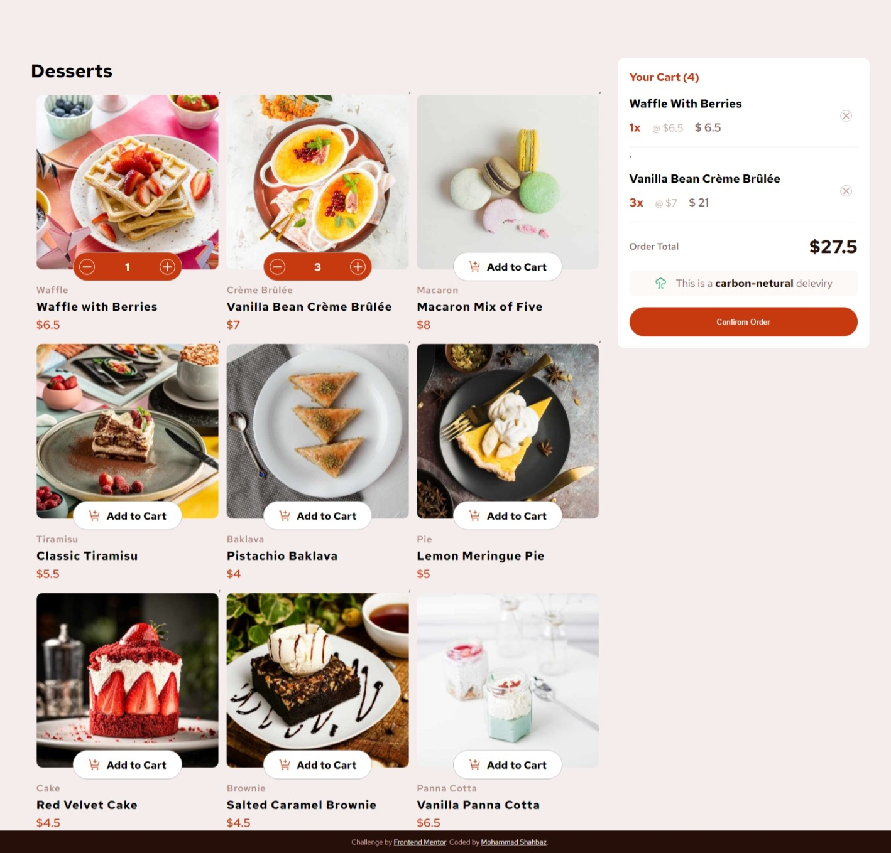

# Frontend Mentor - Product list with cart solution

This is a solution to the [Product list with cart challenge on Frontend Mentor](https://www.frontendmentor.io/challenges/product-list-with-cart-5MmqLVAp_d). Frontend Mentor challenges help you improve your coding skills by building realistic projects. 

## Table of contents

- [Overview](#overview)
  - [The challenge](#the-challenge)
  - [Screenshot](#screenshot)
  - [Links](#links)
- [My process](#my-process)
  - [Built with](#built-with)
  - [What I learned](#what-i-learned)
  - [Continued development](#continued-development)
- [Author](#author)

## Overview

###  challenge was 👇

Users should be able to:

- Add items to the cart and remove them
- Increase/decrease the number of items in the cart
- See an order confirmation modal when they click "Confirm Order"
- Reset their selections when they click "Start New Order"
- View the optimal layout for the interface depending on their device's screen size
- See hover and focus states for all interactive elements on the page

## Screenshot

### Desktop View onLoad 

### desktop view with cart items

### Screen shows on medium tablets 

### Screen shows on normal  tablets 

### Screen shows on Mobiles

### Prompt box looks with cart items

### Prompt box looks when many items in cart

### Links
- Live Site URL: [live site URL  is here](https://product-list-frontendmentor-challange.netlify.app/)
- Solution URL: [solution github repo](https://github.com/shahbazm788/frontend-mentor-challenge-Product-list-with-cart)

## My process

### Built with 
-Most of work done in pure javascrupt
- Semantic HTML5 markup
- CSS custom properties
- Flexbox
- Mobile-first workflow

### What I learned
Revise my Javascript development skill ❤️

### Continued development?? 
Yes it will be updated I will try to decrease my key strokes to increase performance and better readability 

## Author

- Website - [Mohammad Shahbaz](shahbaz-portfolio-eta.vercel.app)
- Frontend Mentor - [@Mohammad Shahbaz](https://www.frontendmentor.io/profile/shahbazm788)
- github - [shahbazm788] - [https://github.com/shahbazm788]

